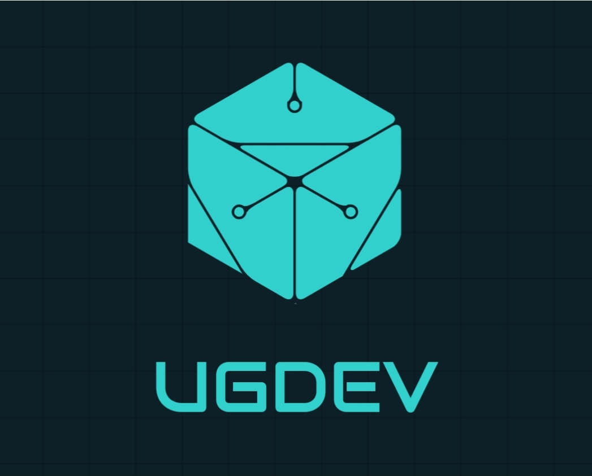

<p align="center">
	<h1 align="center">
		ug-webAdminPanel
	</h1>
	<p align="center">
		
	</p>
	<h4 align="center">
		UgDev Discord Server (Support Server): &nbsp; <a href="https://discord.gg/XPbfb3AReH" target="_blank"></img></a>
	</h4>
	<p align="center">
		<b>ug-webAdminPanel</b> is a <b>full featured</b> web panel wich allows you to manage your <b><a href="https://github.com/esx-framework/esx-legacy" target="_blank">ESX</a></b> or <a href="https://github.com/qbcore-framework/qb-core" target="_blank"><b>QB-Core</a></b> Server.
	</p>
</p>

<br/>

# Attention!
### ug-webAdminPanel is currently in BETA Mode! So, bugs are normal to be found or to have in the panel! So, we ask that if you find some bugs, to open an Issue ticket in Github section by clicking [here](https://github.com/UgDevOfc/ug-webAdminPanel/issues/new) or to go into our Discord Support Server clicking [here](https://discord.gg/XPbfb3AReH)!

## Features:
- Login Page
- Supports **[ESX](https://github.com/esx-framework/esx-legacy)** or **[QB-Core](https://github.com/qbcore-framework/qb-core)**
- Player Management for **[ESX](https://github.com/esx-framework/esx-legacy)** or **[QB-Core](https://github.com/qbcore-framework/qb-core)**
    - Create Players Via Web
    - Edit Players Data Via Web
    - Delete Players Data Via Web
- More to be added in the future!

## Requirements:
- Web Server
- MySQL Server
- **[ESX](https://github.com/esx-framework/esx-legacy)** or **[QB-Core](https://github.com/qbcore-framework/qb-core)** Server

## How to Install:
- https://docs.ugdev.cf/fivem/ug-webadminpanel/installation/

## License
```
MIT License

Copyright (c) 2022 UgDev

Permission is hereby granted, free of charge, to any person obtaining a copy
of this software and associated documentation files (the "Software"), to deal
in the Software without restriction, including without limitation the rights
to use, copy, modify, merge, publish, distribute, sublicense, and/or sell
copies of the Software, and to permit persons to whom the Software is
furnished to do so, subject to the following conditions:

The above copyright notice and this permission notice shall be included in all
copies or substantial portions of the Software.

THE SOFTWARE IS PROVIDED "AS IS", WITHOUT WARRANTY OF ANY KIND, EXPRESS OR
IMPLIED, INCLUDING BUT NOT LIMITED TO THE WARRANTIES OF MERCHANTABILITY,
FITNESS FOR A PARTICULAR PURPOSE AND NONINFRINGEMENT. IN NO EVENT SHALL THE
AUTHORS OR COPYRIGHT HOLDERS BE LIABLE FOR ANY CLAIM, DAMAGES OR OTHER
LIABILITY, WHETHER IN AN ACTION OF CONTRACT, TORT OR OTHERWISE, ARISING FROM,
OUT OF OR IN CONNECTION WITH THE SOFTWARE OR THE USE OR OTHER DEALINGS IN THE
SOFTWARE.
```
